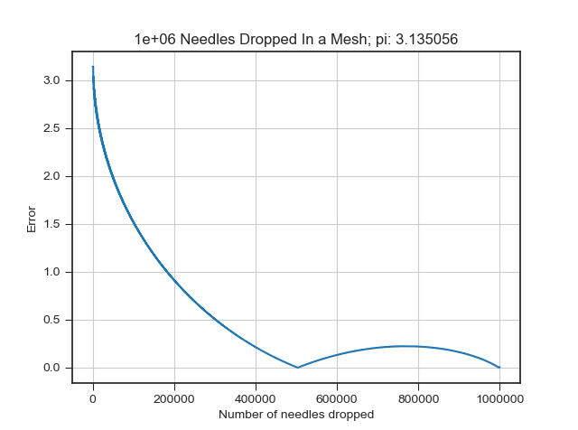

# Estimate-Pi
A program that estimates pi by using a Monte Carlo simulation

Heavily based on Buffon's needle

### Needles Dropped In a Linearly-spaced Mesh:

### Needles Dropped Randomly:

The random needles converge on the solution much faster! 
This is probably due to the way that the mesh throws the needles at the board starting from the top left and ending at the bottton right. This would explain the regular pattern in the convergence diagrams for the 1e+6 and 1e+7 runs.
